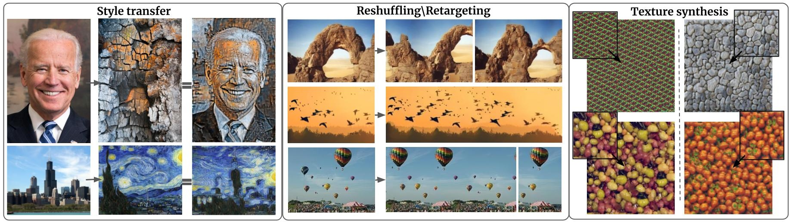
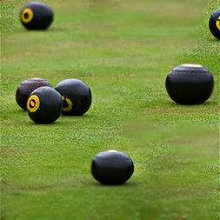
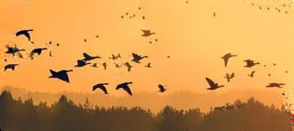
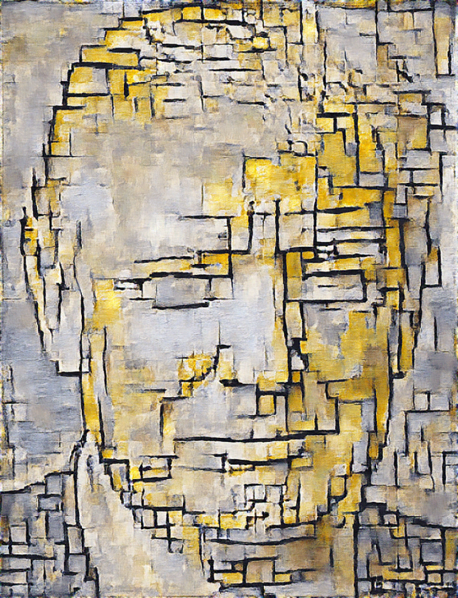
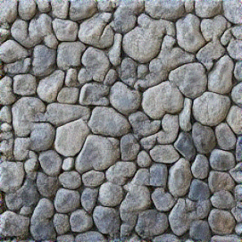

# GPDM
Original Pytorch implementation of the GPDM algorithm introduced in

["Generating Natural Images with Direct Patch Distribution Matching"](https://arxiv.org/abs/2203.11862)

Accepted to [ECCV 2022](https://eccv2022.ecva.net/)

## [**Live-demo**](https://replicate.com/ariel415el/gpdm) | [**Paper**](https://arxiv.org/abs/2203.11862)





# Try out GPDM:
### Reshuffling
`$  python3 main.py data/images/SIGD16/7.jpg`


Output:




### Retargeting
`$ python3 main.py data/images/SIGD16/4.jpg --init_from target --AR_width 1.5`

Output:




###  Style transfer
`$ python3 main.py data/images/style_transfer/style/mondrian.jpg --init_from data/images/style_transfer/content/trump.jpg
--fine_dim 1024 --coarse_dim 256 --noise_sigma 0`

Output:




###  Texture synthesis
`$ python3 main.py data/images/textures/cobbles.jpeg --AR_width 1.5 --AR_height 1.5`
Output:




# Reproduce paper tables
I added the Places50 and SIGD16 datasets from [Drop-The-Gan](https://www.wisdom.weizmann.ac.il/~vision/gpnn/) and [SinGAN](https://tamarott.github.io/SinGAN.htm) so that results can be reproduced

Apart from the datasets from the paper I collected 
some interesting retargeting images in the images folder

In the images folder you can find images I collected from various repos and papers cited in my paper.


# Cite
```
@article{elnekave2022generating,
  title={Generating natural images with direct Patch Distributions Matching},
  author={Elnekave, Ariel and Weiss, Yair},
  journal={arXiv preprint arXiv:2203.11862},
  year={2022}
}
```