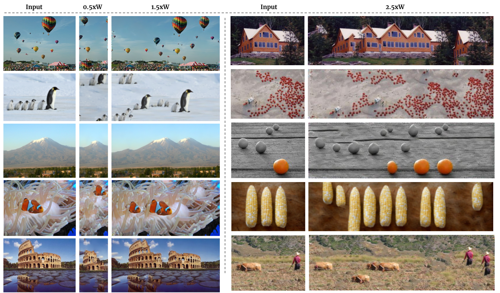
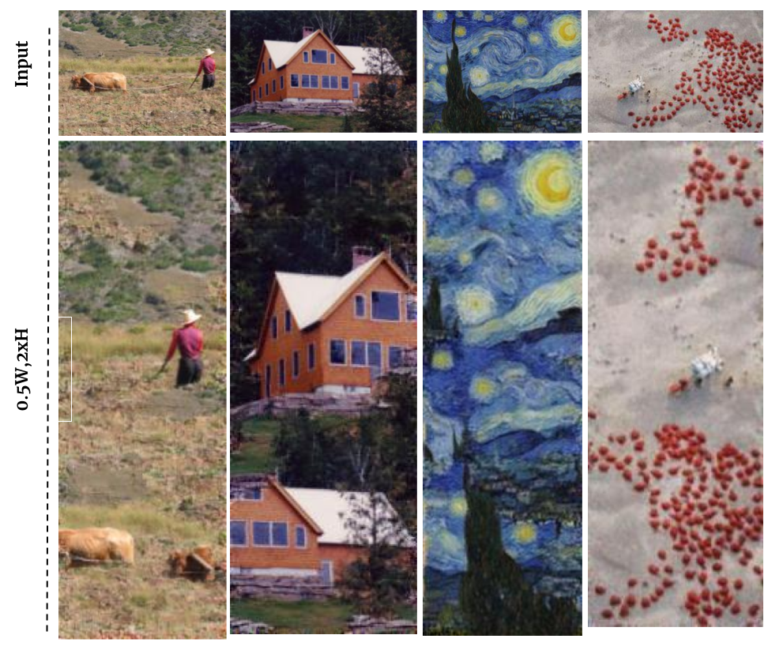
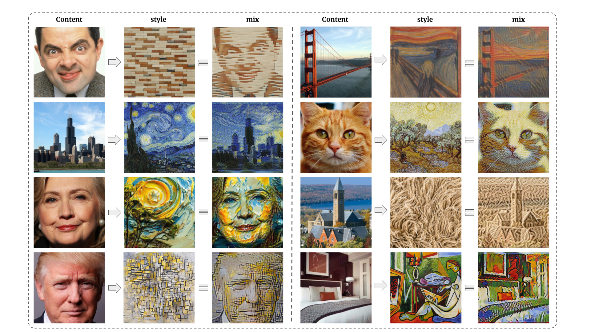

# GPDM
Original Pytorch implementation of the GPDM model introduced in "Generating natural images with direct patch distributions matching"

# Reshuffling
`
python3 scripts/reshuffle_datasets.py
`
I added the Places50 and SIGD16 datasets from Drop-The-Gan and SinGAN so that results can be reproduced

# Retargeting
`
python3 scripts/retarget_images.py
`
Apart from the datasets from the paper I collected some interesting retargeting images in the images folder

[comment]: <> (  )

[comment]: <> (
)
[comment]: <> (  )
[comment]: <> (   )
[comment]: <> (
)

 

# Retargeting
`
python3 scripts/style_transfer.py
`
In the images folder you can find images I collected from various repos and papers cited in my paper.

